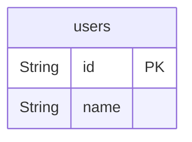

# Nestia Bug Report
> Generated by [`prisma-markdown`](https://github.com/samchon/prisma-markdown)

- [default](#default)

## default

```mermaid
erDiagram
"users" {
  String id PK
  String name
}
```

### `users`

**Properties**
  - `id`: 
  - `name`: 